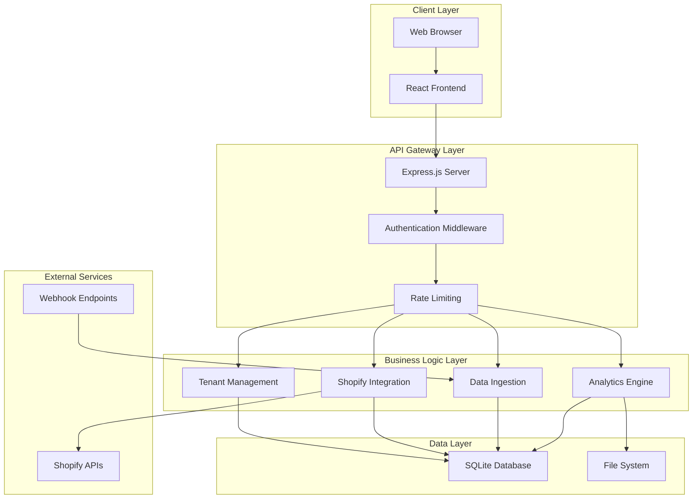
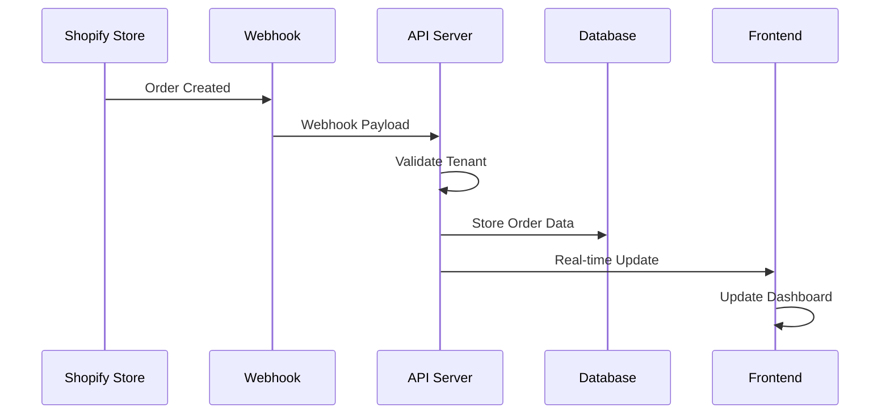
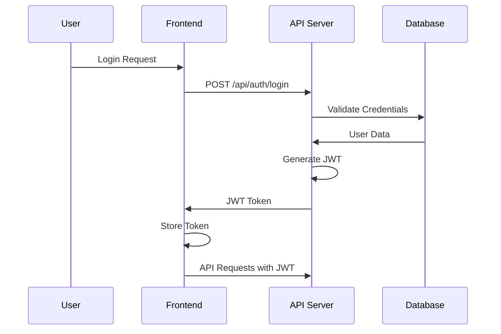
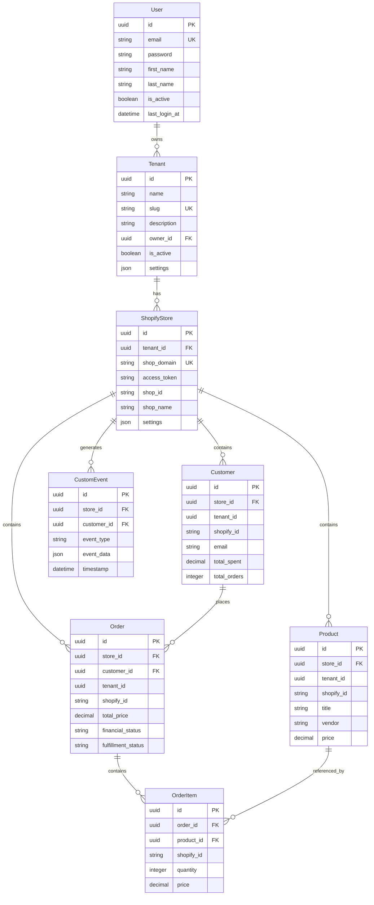
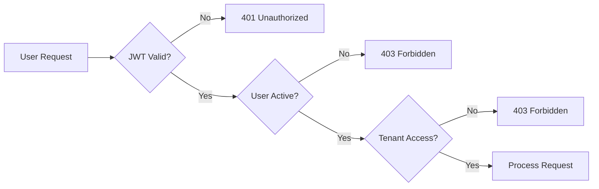
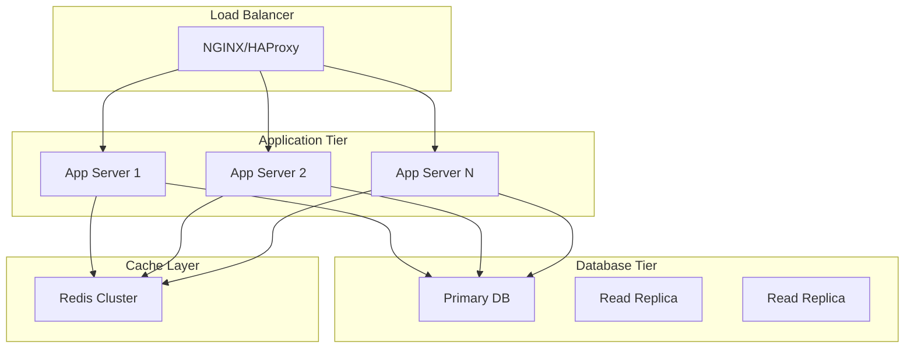
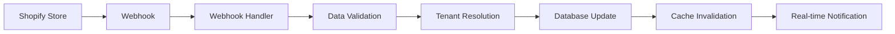
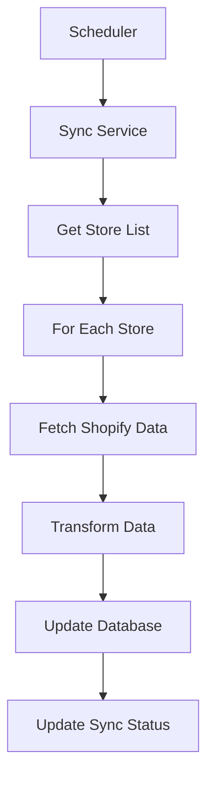
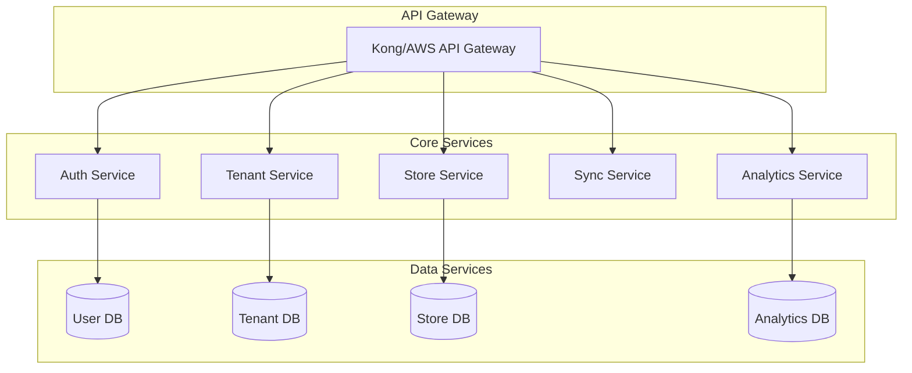
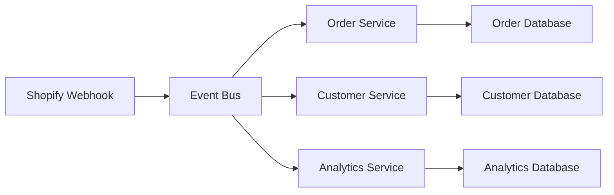

# 🏗️ Architecture Documentation

## System Architecture Overview

The Xeno Shopify Data Ingestion & Insights Service is built as a multi-tenant SaaS platform that enables enterprise retailers to connect their Shopify stores and gain comprehensive business insights.

## 🎯 High-Level Architecture



## 🏢 Multi-Tenant Architecture

### Tenant Isolation Strategy

The application implements **Database-level tenant isolation** using tenant IDs across all data models:

```javascript
// Every data model includes tenantId for isolation
const Customer = {
  id: UUID,
  tenantId: UUID,        // Tenant isolation
  storeId: UUID,         // Store within tenant
  shopifyId: String,     // Shopify's ID
  // ... other fields
}
```

### Tenant Hierarchy

```
User (1) ──→ (Many) Tenants (1) ──→ (Many) ShopifyStores
    │              │                        │
    │              │                        │
    └─ Authentication    └─ Data Isolation    └─ Data Ingestion
```

## 📊 Data Flow Architecture

### 1. Data Ingestion Flow



### 2. Authentication Flow



## 🗄️ Database Design

### Entity Relationship Diagram



### Indexing Strategy

```sql
-- Performance indexes for multi-tenant queries
CREATE INDEX idx_customers_tenant_store ON customers(tenant_id, store_id);
CREATE INDEX idx_orders_tenant_store ON orders(tenant_id, store_id);
CREATE INDEX idx_products_tenant_store ON products(tenant_id, store_id);

-- Shopify ID lookups
CREATE UNIQUE INDEX idx_customers_shopify ON customers(store_id, shopify_id);
CREATE UNIQUE INDEX idx_products_shopify ON products(store_id, shopify_id);
CREATE UNIQUE INDEX idx_orders_shopify ON orders(store_id, shopify_id);

-- Analytics queries
CREATE INDEX idx_orders_created_at ON orders(shopify_created_at);
CREATE INDEX idx_customers_total_spent ON customers(total_spent DESC);
```

## 🔄 API Architecture

### RESTful API Design

```
/api/auth/*
├── POST /register          # User registration
├── POST /login             # User authentication
├── GET  /me               # Get current user
└── POST /logout           # User logout

/api/tenants/*
├── GET    /               # List user's tenants
├── POST   /               # Create new tenant
├── GET    /:id            # Get tenant details
├── PUT    /:id            # Update tenant
└── DELETE /:id            # Delete tenant

/api/shopify/:tenantId/*
├── GET    /stores         # List tenant's stores
├── POST   /connect        # Connect new store
├── GET    /stores/:id     # Get store details
├── POST   /stores/:id/sync # Manual sync
└── DELETE /stores/:id     # Disconnect store

/api/insights/:tenantId/*
├── GET /overview          # Dashboard overview
├── GET /customers         # Customer analytics
├── GET /orders            # Order analytics
├── GET /products          # Product analytics
└── GET /revenue           # Revenue analytics
```

### API Response Format

```javascript
// Success Response
{
  "success": true,
  "message": "Operation successful",
  "data": { /* response data */ },
  "timestamp": "2025-09-13T17:44:36.838Z"
}

// Error Response
{
  "success": false,
  "error": "Error message",
  "code": "ERROR_CODE",
  "details": [ /* validation errors */ ],
  "timestamp": "2025-09-13T17:44:36.838Z"
}
```

## 🔒 Security Architecture

### Authentication & Authorization



### Security Layers

1. **Transport Security**
   - HTTPS enforcement
   - CORS configuration
   - Security headers (Helmet.js)

2. **Authentication Security**
   - JWT tokens with expiration
   - Password hashing (bcrypt)
   - Rate limiting on auth endpoints

3. **Data Security**
   - Input validation and sanitization
   - SQL injection prevention (Sequelize ORM)
   - Tenant data isolation

4. **API Security**
   - Request rate limiting
   - API key validation (for webhooks)
   - Request size limits

## 📈 Scalability Considerations

### Horizontal Scaling Strategy



### Performance Optimizations

1. **Database Level**
   - Proper indexing strategy
   - Query optimization
   - Connection pooling
   - Read replicas for analytics

2. **Application Level**
   - Response caching
   - Lazy loading
   - Pagination for large datasets
   - Background job processing

3. **Frontend Level**
   - Code splitting
   - Lazy component loading
   - Image optimization
   - CDN for static assets

## 🔄 Data Synchronization

### Real-time Sync Strategy



### Batch Sync Strategy



## 📊 Monitoring & Observability

### Logging Strategy

```javascript
// Structured logging example
{
  "timestamp": "2025-09-13T17:44:36.838Z",
  "level": "info",
  "service": "xeno-shopify-backend",
  "tenantId": "uuid",
  "userId": "uuid",
  "action": "order_created",
  "shopifyId": "12345",
  "duration": 150,
  "status": "success"
}
```

### Metrics Collection

1. **Business Metrics**
   - Orders per tenant
   - Revenue trends
   - Customer acquisition
   - Sync success rates

2. **Technical Metrics**
   - API response times
   - Database query performance
   - Error rates
   - Memory usage

3. **User Metrics**
   - Active users
   - Feature usage
   - Session duration
   - Conversion rates

## 🚀 Deployment Architecture

### Production Environment

```mermaid
graph TB
    subgraph "CDN"
        CDN[CloudFlare/AWS CloudFront]
    end
    
    subgraph "Load Balancer"
        LB[Application Load Balancer]
    end
    
    subgraph "Application Servers"
        A1[App Server 1]
        A2[App Server 2]
        A3[App Server N]
    end
    
    subgraph "Database Cluster"
        DB1[Primary PostgreSQL]
        DB2[Read Replica 1]
        DB3[Read Replica 2]
    end
    
    subgraph "Cache Layer"
        R1[Redis Cluster]
    end
    
    subgraph "External Services"
        S1[Shopify APIs]
        S2[Monitoring Services]
    end
    
    CDN --> LB
    LB --> A1
    LB --> A2
    LB --> A3
    A1 --> DB1
    A2 --> DB1
    A3 --> DB1
    A1 --> R1
    A2 --> R1
    A3 --> R1
    A1 --> S1
    A2 --> S1
    A3 --> S1
```

### Container Architecture

```yaml
# docker-compose.yml structure
version: '3.8'
services:
  backend:
    build: ./server
    environment:
      - NODE_ENV=production
      - DATABASE_URL=postgresql://...
    depends_on:
      - database
      - redis
  
  frontend:
    build: ./client
    environment:
      - REACT_APP_API_URL=http://backend:5001
  
  database:
    image: postgres:15
    environment:
      - POSTGRES_DB=xeno
      - POSTGRES_USER=xeno
      - POSTGRES_PASSWORD=password
  
  redis:
    image: redis:7-alpine
```

## 🔮 Future Architecture Considerations

### Microservices Migration



### Event-Driven Architecture



This architecture provides a solid foundation for a production-ready multi-tenant SaaS platform while maintaining flexibility for future enhancements and scaling requirements.
